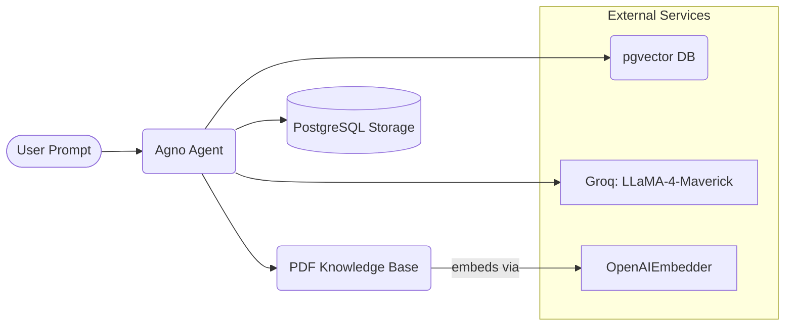

# 📄 Agentic AI PDF Assistant

> Smart assistant that understands and answers questions from PDF documents using **Groq LLM**, **OpenAI embeddings**, and **vector search via PostgreSQL** — powered by [Agno](https://pypi.org/project/agno/).

---

## ✨ Features

| Capability            | Details                                                                                              |
|-----------------------|------------------------------------------------------------------------------------------------------|
| **PDF Ingestion**      | Loads a remote PDF file and extracts meaningful content.                                             |
| **Embedding**          | Uses OpenAIEmbedder to convert PDF chunks into searchable vectors.                                  |
| **Vector Search**      | Hybrid semantic + keyword retrieval using `pgvector`.                                                |
| **Groq LLM Agent**     | Answers questions using LLaMA-4-Maverick via Groq API.                                               |
| **Contextual Memory**  | Remembers previous queries within a session using `PostgresStorage`.                                 |
| **Typer CLI**          | Clean CLI experience with Markdown support for responses.                                            |
| **Dockerized DB**      | pgvector-enabled PostgreSQL runs in a Docker container for easy setup.                              |

---

## 🧠 Architecture


---

## ⚡ Quick Start

```
# 1) Clone the repo
git clone https://github.com/your-username/agentic_ai_pdf_assistant_agent.git
cd agentic_ai_pdf_assistant_agent

# 2) Create and activate a virtual environment
python -m venv venv
source venv/bin/activate          # or venv\Scripts\activate on Windows

# 3) Install dependencies
pip install -r requirements.txt

# 4) Configure secrets
cp .env.example .env              # OR create manually
$EDITOR .env                      # Add GROQ_API_KEY, OPENAI_API_KEY, DATABASE_URL

```
---

## 🐳 Start Vector Database (pgvector + PostgreSQL)

docker run -d \
  -e POSTGRES_DB=ai \
  -e POSTGRES_USER=ai \
  -e POSTGRES_PASSWORD=ai \
  -e PGDATA=/var/lib/postgresql/data/pgdata \
  -v pgvolume:/var/lib/postgresql/data \
  -p 5532:5432 \
  --name pgvector \
  agnohq/pgvector:16

---

## ▶️ Run the Assistant

python pdf_assistant.py

You’ll be greeted with a CLI agent. Try asking:
  > What ingredients are needed for Thai Green Curry?
  
